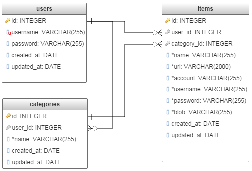

..
      Copyright 2017 OpenPassPhrase
      All Rights Reserved.

      Licensed under the Apache License, Version 2.0 (the "License"); you may
      not use this file except in compliance with the License. You may obtain
      a copy of the License at

          http://www.apache.org/licenses/LICENSE-2.0

      Unless required by applicable law or agreed to in writing, software
      distributed under the License is distributed on an "AS IS" BASIS, WITHOUT
      WARRANTIES OR CONDITIONS OF ANY KIND, either express or implied. See the
      License for the specific language governing permissions and limitations
      under the License.

.. _architecture:

Architecture
=============

Stay turned for fancy diagrams. In the meantime, here's a verbal description of
the OpenPassPhrase architecture.

.. _front-end:

Front-end
---------
The user-facing front-end planned for the future is expected to interact with
the OpenPassPhrase backend through the API. A tpical flow consists of
calling the ``users`` endpoint to register a new user, then calling the
``login`` endpoint to obtain a JSON Web Token (JWT). The token is then added
to every request's headers for requests to all the other endpoints.
Additionally, a passphrase header must also supplied with every request.
This value will be used to encrypt and decrypt the secrets.

Backend
-------
The API services all requests via a `Flask <http://flask.pocoo.org/>`_-enabled
module. Flask takes care of routing requests to the appropriate endpoints and
sending responses out to the WSGI server.

Request  handlers
-----------------
Individual enpdoint (``users``, ``categories``, ``items``) are serviced
respectively by handlers, which implement the specific CRUD functionality for
each endpoint. The handlers take care of checking request parameters and
calling performing data ciphering (encryption/decryption).

Database layer
--------------

The handlers service the request by interacting with the `opp.db.api
<https://github.com/openpassphrase/opp/blob/master/opp/db/api.py>`_ module,
which implements an abstraction layer for communicating with the database.
The ``opp.db.api`` module uses SQLAlchemy Object Relational Mapper to
access and manipulate the specific RDBMS.

Database schema
---------------

.. centered:: OpenPassPhrase DB schema

Above diagram shows the very simple entity-relationship schema used
by OpenPassPhrase. Of interest, are the fields with an * next to their
name. These are always stored in encrypted form and are never in clear
text except when decrypted in RAM for transmission over TLS. The fields
in the *items* table are likely to change or expand as more usage cases
arise.
